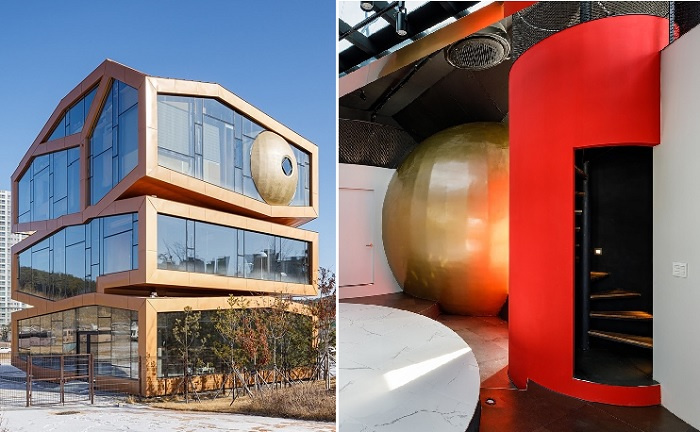
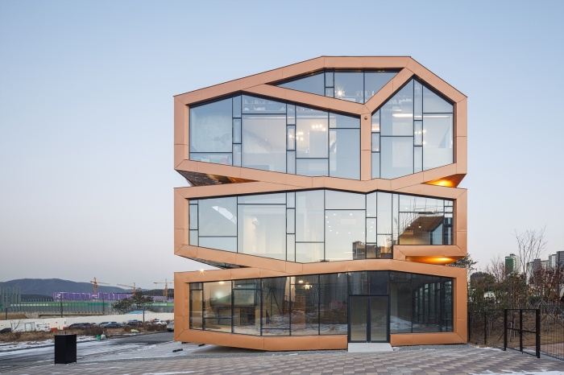
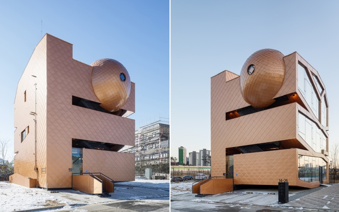
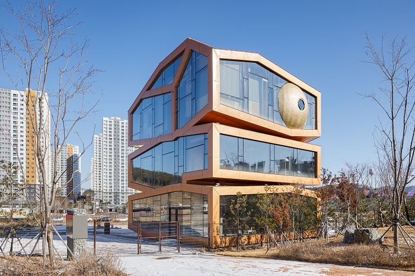

# An "alien" building has appeared in a Seoul suburb that clearly differs from the usual residential architecture

South Korean architecture studio Moon Hoon has completed construction of a futuristic mixed-use building in a new metropolitan area outside of Seoul. Eyewitnesses say the three-story structure called Mars stands out sharply from its surroundings, but would fit perfectly into the landscape of the planet of the same name. The initiator of this construction was a customer who wanted a house that was clearly different from the usual design and architecture of housing.

Often the customer plays a fundamental role in the design of their home and the direction of the design. This is due to the fact that some people want to own something unusual and flashy (and not necessarily a house). It is this desire that forces architects to create distinctive objects. This is what happened in the new urban development of the city of Hwaseong, near Seoul, South Korea.

A businessman asked the South Korean architecture firm Moon Hoon to build a mixed-use building which would contain his residential apartments, two residences for rentals, and commercial space, which was also to be converted into offices or retail outlets. That would have been fine, but the future owner wanted the design of the house to be "alien" and not show elements of conventional housing.

`"A special client with a creative architect can go to the land of fantasy and dreams, where familiar names mean completely different things, and forms take on other dimensions,"` explain their decision to take on an unusual project developers Moon Hoon. "Fortunately, collective impulses and desires have given way to individual inclinations and understandings that will directly help push the boundaries of architecture and take it to a whole new level of lightness and seriousness at the same time."

Their joint efforts have created an extraordinary building boasting a unique façade with a series of geometric glass panels fixed by a frame imitating brass. At the same time, one end and back of the façade are lined with panels resembling metal tile. To enhance the visual effect, a transparent pantheon-style hemisphere and a metal sphere, in the form of a planet, are integrated into the upper part of the house, protruding beyond the structure of the building. Strange as they are for a residential facility, the structural elements perfectly accentuate the futuristic aesthetic as well as providing additional spatial shelter for its occupants.

According to the editorial, the authors of the project decided to use these "alien" introductions to make the structure more distinctive, because they wanted "the house to be seen as a small symbolic universe where spaceships and planets are jumbled up randomly, evoking associations with some strange galaxy".

